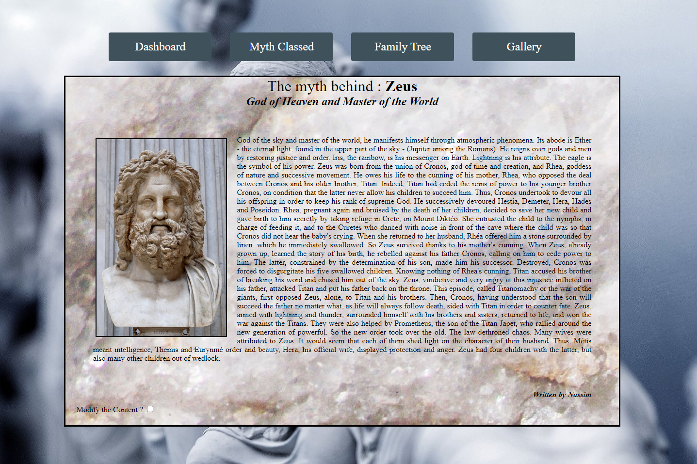

# Helenic-Myth


This website is build to permit people to share their passion about greek mythologie, in this objectiv we create a CMS and CRUD website where you can share articles about your favorite greek myth !
Built in Angular 10 !

Find it just here : https://helenic-myth.netlify.app/
<p align="center"></p>

## Installation
It's already online if you wanna check-it out, but if you want to use the code then follow the following instructions. 
Simply download the whole project, then set up your envirnment for Angular if you haven't done it yet (you need to have Node.js installed and npm package manager):
 ```
- npm install -g @angular/cli
 ```
Then in the directory where you put the project, use the following command to start, it will open a new page with the website on your broswer :
 ```
- ng serve --open
 ```


## Features
On this application, i implemetended multiples features such as :
 - Creation of an article, with FormControl on Angular
 - Deletion and update of those article
 - Display those article in multiple way (by type or categorie, by creation chronologie, by Gallery Art)
 - Search Bar to find Article


## Contact
- Don't hesitate to reach me on github or Linkedin !


